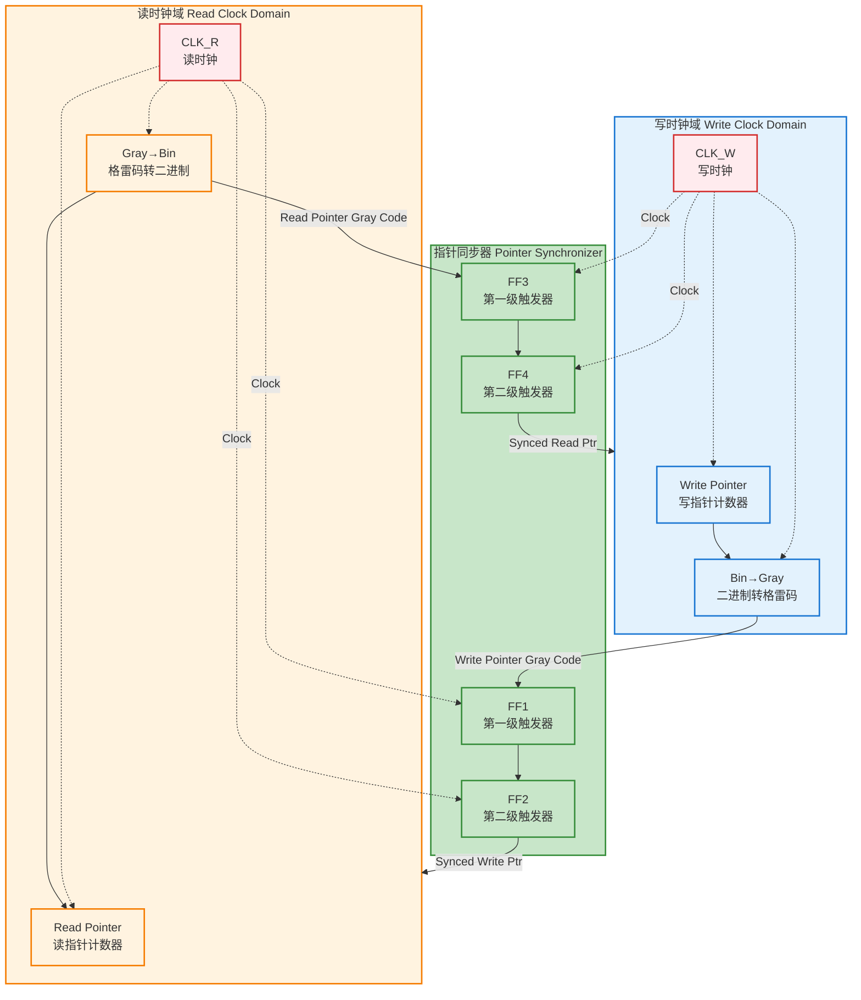
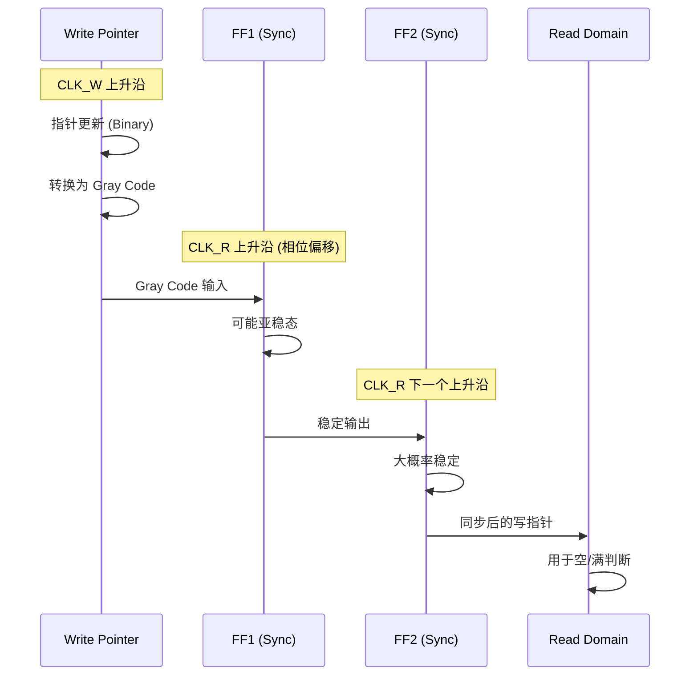

# 异步FIFO指针同步器原理示意图

> **假设条件**：两边的时钟是同频不同步的（Same Frequency, Out-of-Phase）

## 原理图



## 时钟波形示意图

### 同频不同相时钟关系

```mermaid
gantt
    title 时钟波形时序 (同频不同相)
    dateFormat X
    axisFormat %s
    
    section CLK_W (写时钟)
    上升沿1    :0, 1
    下降沿1    :1, 1
    上升沿2    :2, 1
    下降沿2    :2, 1
    
    section CLK_R (读时钟)
    上升沿1(相位偏移) :0.3, 1
    下降沿1    :1.3, 1
    上升沿2(相位偏移) :2.3, 1
    下降沿2    :2.3, 1
```



### 时钟相位关系说明

```
CLK_W:  ┌─┐ ┌─┐ ┌─┐ ┌─┐
        │ │ │ │ │ │ │ │
        └─┘ └─┘ └─┘ └─┘
        
CLK_R:    ┌─┐ ┌─┐ ┌─┐ ┌─┐
          │ │ │ │ │ │ │ │
          └─┘ └─┘ └─┘ └─┘
          
        ↑ 相位偏移 (Phase Offset)
        
频率: 相同 (Same Frequency)
相位: 不同 (Out of Phase)
```

### 指针同步时序



## 关键特性

### 1. 格雷码编码 (Gray Code)
- **目的**：确保指针每次只有1位变化
- **优势**：减少跨时钟域传输时的亚稳态风险
- **实现**：写时钟域使用 `Bin→Gray` 转换，读时钟域使用 `Gray→Bin` 转换

### 2. 双触发器同步器 (2-FF Synchronizer)
- **FF1/FF3**：第一级触发器，捕获异步信号
- **FF2/FF4**：第二级触发器，稳定输出，消除亚稳态
- **时钟域隔离**：
  - FF1、FF2 使用读时钟 (CLK_R)
  - FF3、FF4 使用写时钟 (CLK_W)

### 3. 双向同步
- **写指针同步**：Write Pointer (Gray) → FF1 → FF2 → Read Domain
- **读指针同步**：Read Pointer (Gray) → FF3 → FF4 → Write Domain

### 4. 同频不同步时钟
- **频率相同**：CLK_W 和 CLK_R 频率相同
- **相位不同**：两个时钟之间存在相位差
- **应用场景**：来自不同时钟源的相同频率时钟

## 工作原理

### 写指针同步流程

```
写时钟域                         同步器                   读时钟域
┌─────────────┐                 ┌──────────┐            ┌─────────────┐
│ Write Ptr   │                 │          │            │             │
│ (Binary)    │                 │   FF1    │──CLK_R───▶│             │
│     │       │                 │          │            │             │
│     ▼       │                 │   FF2    │──CLK_R───▶│  Empty/Full │
│ Bin→Gray    │──Gray Code───▶│          │            │  Detection  │
│     │       │                 │          │            │             │
└─────────────┘                 └──────────┘            └─────────────┘
```

### 读指针同步流程

```
读时钟域                         同步器                   写时钟域
┌─────────────┐                 ┌──────────┐            ┌─────────────┐
│ Read Ptr    │                 │          │            │             │
│ (Binary)    │                 │   FF3    │──CLK_W───▶│             │
│     │       │                 │          │            │             │
│     ▼       │                 │   FF4    │──CLK_W───▶│  Empty/Full │
│ Gray→Bin    │──Gray Code───▶│          │            │  Detection  │
│     │       │                 │          │            │             │
└─────────────┘                 └──────────┘            └─────────────┘
```

## 时序说明

### 同步延迟
- **最小延迟**：2个目标时钟周期（2-FF同步器）
- **最大延迟**：取决于时钟相位关系
- **同频不同步**：延迟相对可预测，但仍需考虑相位差

### 亚稳态处理
1. **第一级触发器 (FF1/FF3)**：可能进入亚稳态
2. **第二级触发器 (FF2/FF4)**：大概率稳定输出
3. **MTBF (Mean Time Between Failures)**：通过两级触发器显著提高

## 应用场景

- ✅ 同频不同步时钟域之间的数据传递
- ✅ 异步FIFO的空/满标志生成
- ✅ 跨时钟域的指针/计数器同步
- ✅ 需要高可靠性的时钟域交叉设计

## 注意事项

1. **格雷码限制**：FIFO深度必须是2的幂次方
2. **同步延迟**：同步后的指针有延迟，空/满判断需要留出安全余量
3. **时钟质量**：确保时钟信号质量良好，减少亚稳态风险
4. **相位关系**：同频不同步时，相位差会影响同步延迟

## ASCII 简化原理图

如果上面的 Mermaid 图表无法显示，可以参考下面的 ASCII 图：

```
┌─────────────────────────────────────────────────────────────────────┐
│                    异步FIFO指针同步器原理图                            │
│                  (同频不同步时钟)                                     │
└─────────────────────────────────────────────────────────────────────┘

┌──────────────────────┐         ┌──────────────────┐         ┌──────────────────────┐
│  写时钟域 (CLK_W)    │         │   指针同步器      │         │  读时钟域 (CLK_R)    │
│                      │         │                  │         │                      │
│  ┌──────────────┐   │         │  ┌────┐  ┌────┐ │         │  ┌──────────────┐   │
│  │ Write Pointer│   │         │  │FF1 │→ │FF2 │ │         │  │ Read Pointer │   │
│  │  (Binary)    │   │         │  └────┘  └────┘ │         │  │  (Binary)    │   │
│  └──────┬───────┘   │         │   ↑      ↑      │         │  └──────┬───────┘   │
│         │           │         │   │      │      │         │         │           │
│         ▼           │         │   │CLK_R │CLK_R │         │         ▼           │
│  ┌──────────────┐   │         │   │      │      │         │  ┌──────────────┐   │
│  │ Bin→Gray     │───┼─────────┼───┘      └──────┼─────────┼─→│ Gray→Bin     │   │
│  │ Converter    │   │         │                  │         │  │ Converter    │   │
│  └──────────────┘   │         │  ┌────┐  ┌────┐ │         │  └──────────────┘   │
│         │           │         │  │FF3 │→ │FF4 │ │         │         │           │
│         │           │         │  └────┘  └────┘ │         │         │           │
│         │           │         │   ↑      ↑      │         │         │           │
│         │           │         │   │CLK_W │CLK_W │         │         │           │
│         │           │         │   │      │      │         │         │           │
│  ┌──────▼───────┐   │         │   └──────┴──────┼─────────┼─────────┘           │
│  │   CLK_W      │   │         │                  │         │                      │
│  └──────────────┘   │         └──────────────────┘         │  ┌──────────────┐   │
│                     │                                      │  │   CLK_R      │   │
└──────────────────────┘                                      │  └──────────────┘   │
                                                              └──────────────────────┘

数据流：
Write Pointer (Gray) ──→ FF1 ──→ FF2 ──→ Read Domain (用于空/满判断)
Read Pointer (Gray)  ──→ FF3 ──→ FF4 ──→ Write Domain (用于空/满判断)

时钟关系：
CLK_W: ┌─┐ ┌─┐ ┌─┐ ┌─┐  (写时钟)
       │ │ │ │ │ │ │ │
       └─┘ └─┘ └─┘ └─┘
       
CLK_R:   ┌─┐ ┌─┐ ┌─┐ ┌─┐  (读时钟，相位偏移)
         │ │ │ │ │ │ │ │
         └─┘ └─┘ └─┘ └─┘
         
频率: 相同
相位: 不同
```

## 快速参考

| 组件 | 功能 | 时钟域 |
|------|------|--------|
| Write Pointer | 写指针计数器 | CLK_W |
| Bin→Gray | 二进制转格雷码 | CLK_W |
| FF1, FF2 | 写指针同步器 | CLK_R |
| Read Pointer | 读指针计数器 | CLK_R |
| Gray→Bin | 格雷码转二进制 | CLK_R |
| FF3, FF4 | 读指针同步器 | CLK_W |

---

*本示意图展示了异步FIFO指针同步器的核心原理，适用于同频不同步时钟场景。*

**GitHub 查看提示**：如果 Mermaid 图表无法显示，请确保：
1. 在 GitHub 网页上查看（不是本地编辑器）
2. 文件扩展名为 `.md`
3. 使用最新版本的 GitHub 界面
