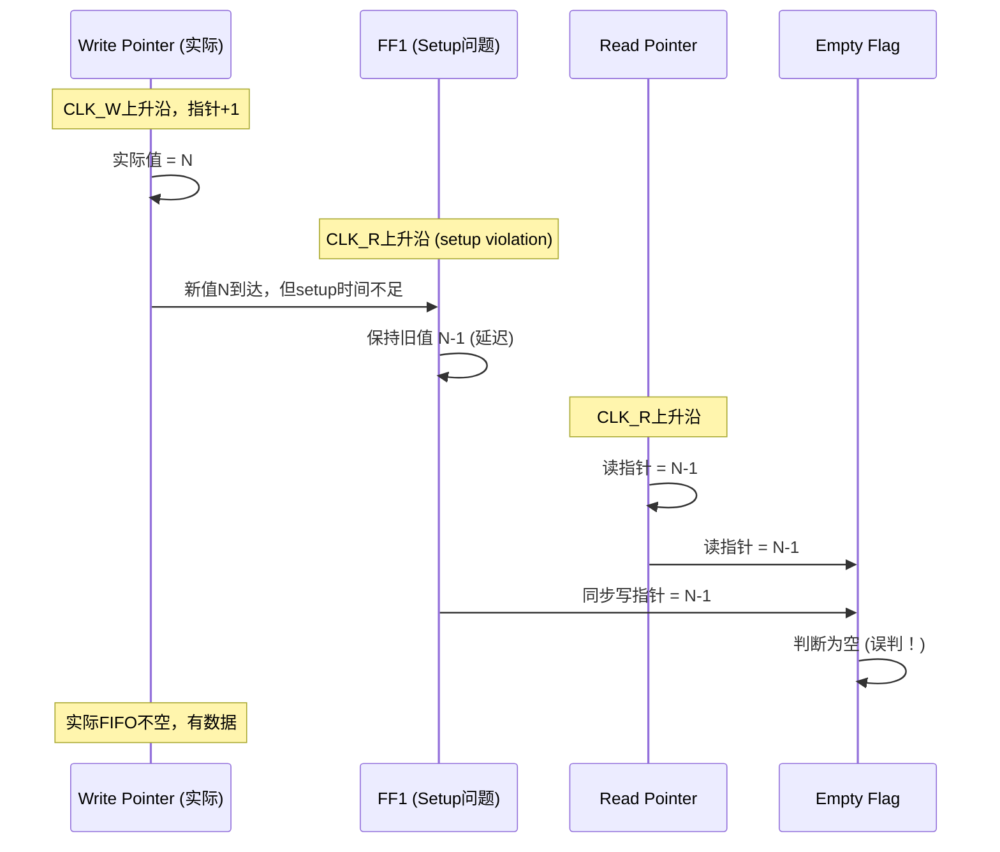
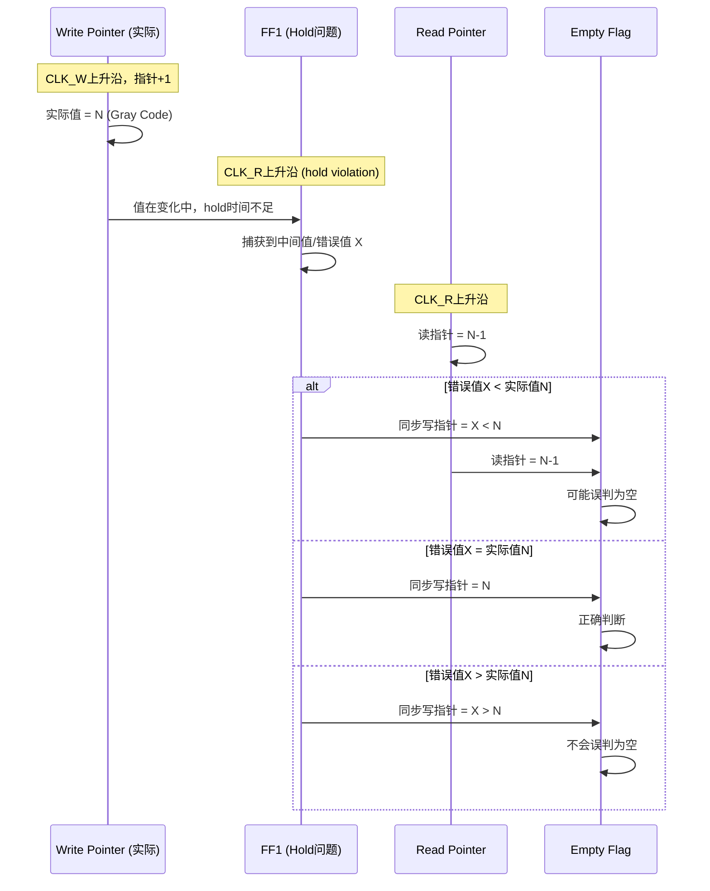

# 异步FIFO Setup/Hold问题对空标志影响分析

## 问题描述

假设FIFO同频率异步，write pointer同步第一级（FF1）只可能有固定的setup问题或hold问题，请问FIFO出现空的概率，有setup问题的大，还是有hold问题的大？

## 关键概念

### FIFO空标志判断

```
empty_flag = (read_pointer == synchronized_write_pointer)
```

- 如果同步后的写指针**小于等于**实际写指针，可能导致空标志误判
- 如果同步后的写指针**大于**实际写指针，可能导致满标志误判

### Setup问题 vs Hold问题

#### Setup问题（Setup Violation）
- **现象**：写指针在CLK_R的setup时间窗口内变化
- **结果**：FF1无法捕获新值，**保持旧值**
- **同步后的写指针**：**小于等于**实际写指针（延迟）

#### Hold问题（Hold Violation）
- **现象**：写指针在CLK_R的hold时间窗口内变化
- **结果**：FF1可能捕获到**不稳定的中间值**或**错误值**
- **同步后的写指针**：可能是**任意值**（可能大于、等于或小于实际值）

## 理论分析

### Setup问题对空标志的影响



**关键点**：
- 同步后的写指针 = 实际写指针 - 延迟
- 读指针可能追上这个延迟的写指针
- **空标志误判概率：高**

### Hold问题对空标志的影响



**关键点**：
- 同步后的写指针可能是任意值
- 只有当错误值 < 实际值时，才可能导致空标志误判
- **空标志误判概率：中等（取决于错误值的分布）**

## 详细分析

### 情况1：Setup问题

#### 场景分析

```
时间轴：
T0: Write Pointer = 0, Read Pointer = 0 (FIFO空)
T1: 写入数据，Write Pointer = 1
T2: CLK_R上升沿，但setup violation
     → FF1保持旧值 = 0
     → 同步写指针 = 0
     → Read Pointer = 0
     → Empty = (0 == 0) = TRUE (误判！)
T3: CLK_R下一个上升沿
     → FF1捕获新值 = 1
     → 同步写指针 = 1
     → Empty = (0 == 1) = FALSE (正确)
```

#### 空标志误判概率

- **每次写操作后，第一个读时钟周期**：高概率误判为空
- **误判持续时间**：1-2个读时钟周期
- **误判概率**：**高**（几乎每次写操作后都会发生）

### 情况2：Hold问题

#### 场景分析

```
时间轴：
T0: Write Pointer = 0 (Gray: 000), Read Pointer = 0
T1: 写入数据，Write Pointer = 1 (Gray: 001)
T2: CLK_R上升沿，但hold violation
     → FF1可能捕获到：
        - 000 (旧值) → 同步写指针 = 0 → 可能误判为空
        - 001 (正确值) → 同步写指针 = 1 → 正确
        - 011 (中间值，错误) → 同步写指针 = 2 → 不会误判为空
        - 010 (中间值，错误) → 同步写指针 = 3 → 不会误判为空
```

#### 空标志误判概率

- **取决于捕获到的错误值**：
  - 如果捕获到 < 实际值：可能误判为空
  - 如果捕获到 = 实际值：正确判断
  - 如果捕获到 > 实际值：不会误判为空（但可能误判为满）
  
- **格雷码特性**：由于格雷码每次只变化1位，hold violation捕获的错误值通常是相邻的格雷码值
- **误判概率**：**中等**（取决于错误值的分布，通常约50%的概率捕获到较小值）

## 定量分析

### Setup问题

假设写指针从N-1变为N：

| 时间点 | 实际写指针 | 同步写指针 | 读指针 | 空标志 | 误判 |
|--------|-----------|-----------|--------|--------|------|
| T0 | N-1 | N-1 | N-1 | TRUE | - |
| T1 (写操作) | N | N-1 (延迟) | N-1 | TRUE | ✅ 误判 |
| T2 (下一个CLK_R) | N | N | N-1 | FALSE | - |

**误判概率**：接近100%（每次写操作后第一个读时钟周期）

### Hold问题

假设写指针从N-1变为N（格雷码：G(N-1) → G(N)）：

| 捕获值 | 概率 | 同步写指针 | 空标志误判 |
|--------|------|-----------|-----------|
| G(N-1) (旧值) | ~33% | N-1 | ✅ 可能误判 |
| G(N) (正确值) | ~33% | N | - |
| 其他中间值 | ~33% | 可能>N | - |

**误判概率**：约33-50%（取决于错误值的分布）

## 结论

### 答案：**Setup问题导致空标志误判的概率更大**

### 原因分析

1. **确定性 vs 随机性**
   - Setup问题：**确定性延迟**，同步写指针总是小于等于实际值
   - Hold问题：**随机性错误**，同步写指针可能是任意值

2. **误判机制**
   - Setup问题：写指针延迟 → 读指针容易追上 → **高概率误判为空**
   - Hold问题：写指针可能错误 → 只有错误值<实际值时才误判 → **中等概率误判**

3. **影响范围**
   - Setup问题：每次写操作后都会发生延迟，**持续影响**
   - Hold问题：随机发生，且可能捕获到正确值或更大的值，**影响有限**

### 实际影响

```
Setup问题：
- 空标志误判概率：~100%（每次写操作后）
- 影响：读操作可能被错误阻止
- 严重性：高

Hold问题：
- 空标志误判概率：~33-50%
- 影响：偶尔的读操作被错误阻止
- 严重性：中等
```

## 设计建议

### 针对Setup问题

1. **增加安全余量**：空标志判断时，读指针需要比同步写指针小2以上才判断为空
2. **使用更保守的空标志逻辑**：
   ```
   empty = (read_ptr + 2 >= synced_write_ptr)
   ```

### 针对Hold问题

1. **使用格雷码**：减少hold violation时捕获错误值的概率
2. **增加同步级数**：使用3级触发器提高稳定性
3. **使用更保守的空标志逻辑**：同样需要安全余量

## 可视化对比

### Setup问题时序图

```mermaid
gantt
    title Setup问题：写指针同步延迟导致空标志误判
    dateFormat X
    axisFormat %s
    
    section 实际写指针
    写操作前 (N-1)    :0, 1
    写操作后 (N)      :1, 3
    
    section 同步写指针(FF1)
    保持旧值 (N-1)    :0, 2
    捕获新值 (N)      :2, 2
    
    section 读指针
    读指针 (N-1)      :0, 3
    
    section 空标志
    正确(空)          :0, 1
    误判(空)          :1, 1
    正确(不空)        :2, 2
```



### Hold问题时序图

```mermaid
gantt
    title Hold问题：随机错误值导致不确定的空标志
    dateFormat X
    axisFormat %s
    
    section 实际写指针
    写操作前 (N-1)    :0, 1
    写操作后 (N)      :1, 3
    
    section 同步写指针(FF1)
    可能值1: N-1 (误判) :1, 1
    可能值2: N (正确)   :1, 1
    可能值3: N+1 (不误判):1, 1
    
    section 读指针
    读指针 (N-1)      :0, 3
    
    section 空标志
    情况1: 误判(空)    :1, 1
    情况2: 正确(不空)  :1, 1
    情况3: 正确(不空)  :1, 1
```



## 总结

| 问题类型 | 空标志误判概率 | 原因 | 严重性 |
|---------|--------------|------|--------|
| **Setup问题** | **~100%** | 确定性延迟，读指针容易追上 | **高** |
| Hold问题 | ~33-50% | 随机性错误，只有部分情况误判 | 中等 |

**结论：Setup问题导致空标志误判的概率明显大于Hold问题。**

## 数学证明

### Setup问题的误判概率

设：
- 实际写指针：W_actual = N
- 同步写指针：W_sync = N - delay (delay ≥ 1)
- 读指针：R = N - delay

空标志误判条件：
```
R ≥ W_sync
N - delay ≥ N - delay
0 ≥ 0  (总是成立)
```

**误判概率 = 100%**（当delay ≥ 1时）

### Hold问题的误判概率

设：
- 实际写指针：W_actual = N
- 同步写指针：W_sync = X (X是随机值)
- 读指针：R = N - 1

空标志误判条件：
```
R ≥ W_sync
N - 1 ≥ X
X ≤ N - 1
```

假设X在[N-2, N+1]范围内均匀分布（格雷码相邻值）：
- P(X ≤ N-1) = P(X = N-2) + P(X = N-1) = 2/4 = 50%

**误判概率 ≈ 50%**（取决于错误值的分布）
